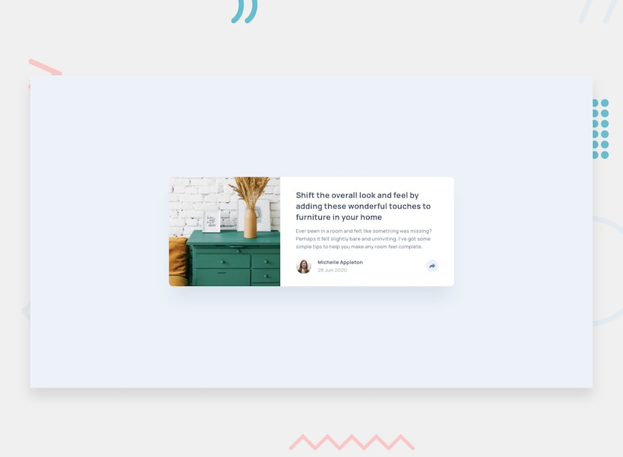

# Frontend Mentor - Article preview component solution

This is a solution to the [Article preview component challenge on Frontend Mentor](https://www.frontendmentor.io/challenges/article-preview-component-dYBN_pYFT). Frontend Mentor challenges help you improve your coding skills by building realistic projects.

## Table of contents

- [Overview](#overview)
    - [The challenge](#the-challenge)
    - [Screenshot](#screenshot)
    - [Links](#links)
- [My process](#my-process)
    - [Built with](#built-with)
- [Local development](#local-development)
- [Author](#author)
- [Acknowledgments](#acknowledgments)

## Overview

### The challenge

Users should be able to:

- View the optimal layout for the component depending on their device's screen size
- See the social media share links when they click the share icon

### Screenshot



### Links

- [Solution URL](https://github.com/Vladislav2397/challenge__article-preview-component)
- [Live Site URL](https://vladislav2397.github.io/challenge__article-preview-component/)

## My process

### Built with

- Semantic HTML5 markup
- [Sass](https://sass-lang.com/) (`src/style.scss`)
- [TypeScript](https://www.typescriptlang.org/) — share/tooltip behavior in `src/main.ts`
- [Vite](https://vitejs.dev/) — dev server and production build
- Flexbox layout
- Mobile-first, responsive styles (design widths: 375px / 1440px — see `style-guide.md`)
- [Manrope](https://fonts.google.com/specimen/Manrope) (Google Fonts)

## Local development

Prerequisites: [Node.js](https://nodejs.org/) (LTS recommended).

```bash
npm install
npm run dev
```

Production build and preview:

```bash
npm run build
npm run preview
```

Static assets for the built app are served from `public/images/`. Challenge colours and typography are documented in [`style-guide.md`](./style-guide.md).

## Author

- Website - [Github](https://github.com/Vladislav2397)
- Frontend Mentor - [@Vladislav2397](https://www.frontendmentor.io/profile/Vladislav2397)
